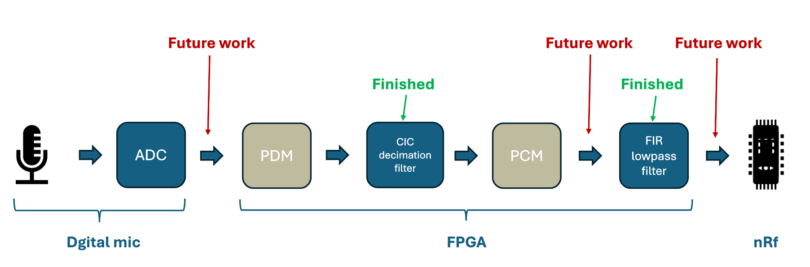
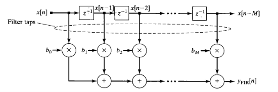
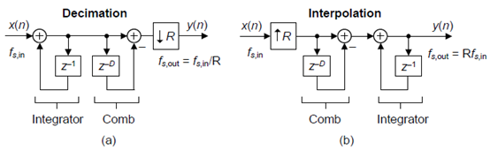

# 2024_spring_capstone

model_composer_fir file: a FIR filter design with 1kHz cutoff frequency and 8kHz sampling rate.

vivado_cic file: a CIC decimation filter design with 64 decimation factor

vivado_fir: a FIR filter implementation file for Zedboard.

==================================================

### FIR Filter

Our goal is to eliminate frequencies greater than 1 kHz, so we set our target cutoff frequency to 1 kHz with an 8 kHz sampling rate. The architecture and filter coefficients were designed using FDA tools in MATLAB, resulting in a 40th order configuration. The order and coefficients were exported to Model Composer's logic block with specified port details. System period adjustments were made in the Hub and Gateway for synchronous and low-frequency capture of the target frequency. For FPGA implementation, a Vivado IP block was constructed with the Zedboard constraint file. JA1 and JA4 ports were configured as inputs with GND, and the JB port as an output, facilitating connection to a DAC board for streaming PCM data output to an oscilloscope.

### CIC Decimation Filter

Our digital microphone outputs a PDM signal incompatible with the PCM input required by the FIR filter. To address this, a CIC decimation filter was employed to integrate and downsample the binary signal into a 32-bit PCM digital signal. The CIC filter was configured with a 64 decimation factor to filter out spikes in the PDM signal. Performance was assessed using a Python script to simulate a mixed signal ranging from 10 Hz to 1.5 kHz. Additionally, a SystemVerilog code was implemented to read PDM binary values from a text file. The test signal was streamed through the CIC filter, and the signal transformation was visualized using Vivado.

*Figure 1: FPGA design flow chart*

*Figure 2: FIR filter design*

*Figure 3: CIC decimation filter design*

testtes