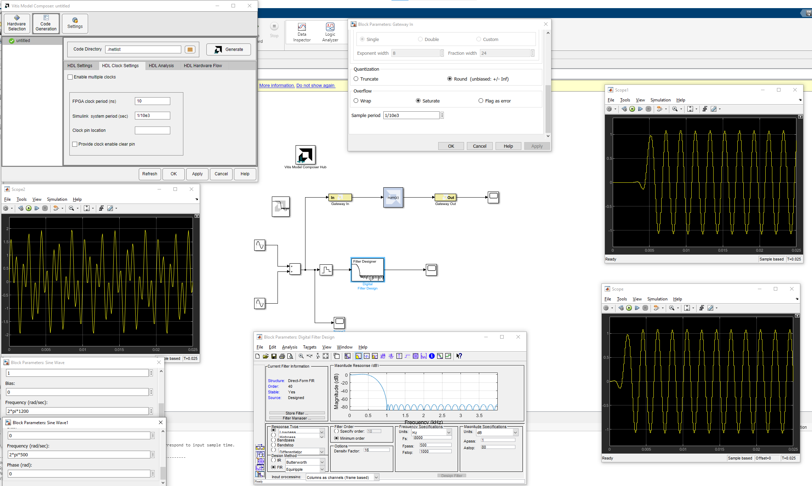

# 2024_spring_capstone

This model composer file is designed for a FIR filter with 1kHz cutoff frequency and 8kHz sampling rate. 

To see the hardware simulation output of the design, open the FIR_filter_1kHz_cutoff.slx filte with Model Composer. After running the simulation, you can double click the scope to see the input and result. If you want to change the testing input frequency, double click the sine wave to modify the frequency.

