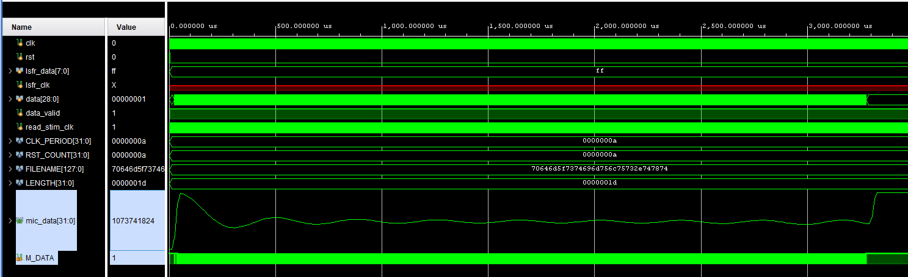
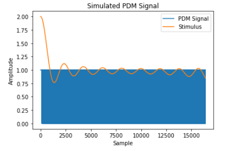

# 2024_spring_capstone_vivado_cic

This vivado project is to simulate the cic decimation filter with a 64 decimation factor. Most of the code is from [this video](https://www.youtube.com/watch?v=m8O8yEiZTvs&ab_channel=FPGAsforBeginners) and [Github](https://github.com/HDLForBeginners/Examples/tree/main/eth_pdm_mic). To run the original author's project easily, you can open the tcl file in the vivado and it will configure all the thing automatically.

In the video, it explain the whole process from the input signal to the display on the computer. For my project, I snippest the code for the simulation usage. Specifically, my project only simulate the PDM signal by Python code, save it as a txt file, stream the binary signal into the cic filter with systemVerilog code, and display the result on the Vivado simulation window.

To run the file, extract the rar file and run the .xpr file in the Vivado. All the blocks showed be configured automatically. However, if the Vivado update to a new version, some IP blocks migh be invalid. To fix the problem, click the IP INTEGRATOR, chose the same IP, and follow the original  IP setting to configure a new one.

